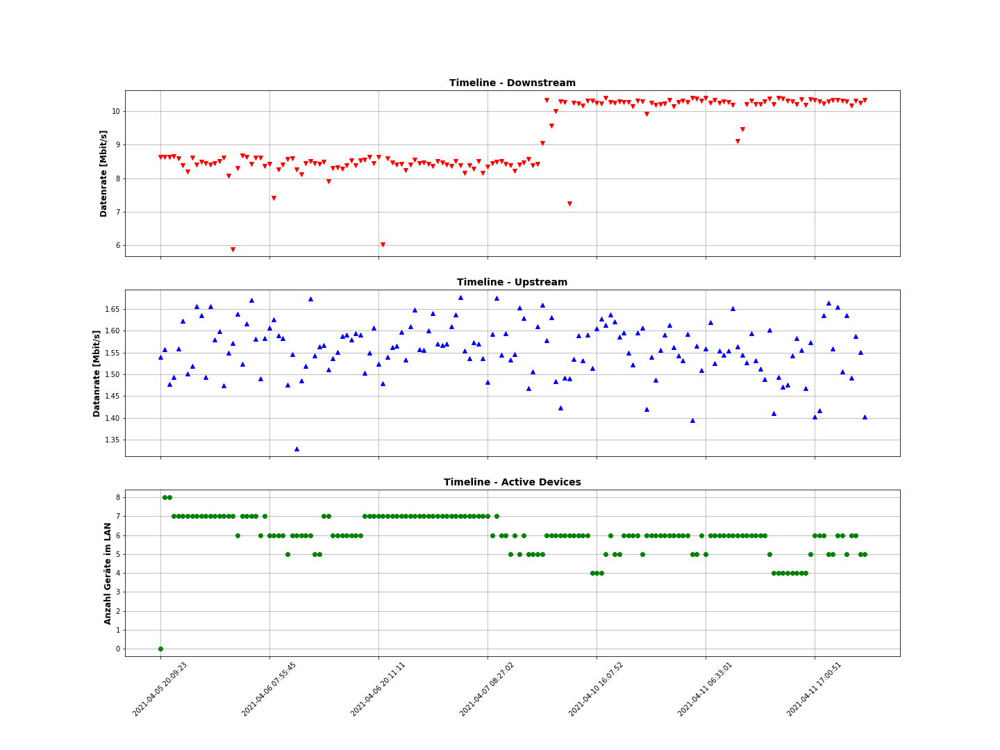
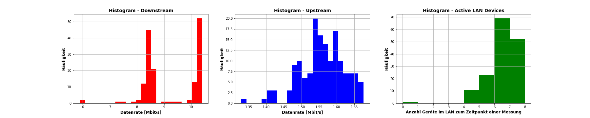

# speedtest

A long term internet speed test using a python script from Matt Martz (https://raw.githubusercontent.com/sivel/speedtest-cli/master/speedtest.py) timed by a systemd timer.

## Dependencies 

- python
- jupyter (jupyter-notebok or jupyter-lab)
- nmap

## Install

1. Clone this repo
2. Run the _**install.sh**_ script

The _**install.sh**_ script installs a systemd timer and service executing _**speedtest.sh**_ every 30 minutes. 

The systemd service needs this repo to stay at it's initial position.
If you want to move this repo to a different location on your lacal file system, make sure to run _**install.sh**_ again afterwards.

## Uninstall

*This section will be added soon*

## Results 

The results can be visualized with the example jupyter-notebook in the evaluation directory.

